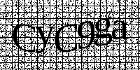

# mail_bouncer

REST service for CAPTCHA-protected email dispatching.

**Use case:** You have a website with no backend code like one produced with a static site generator. You need to send an email e.g. when a user submits a form.
But you can't have your email credentials in the frontend for obvious reasons.

## Endpoints

| URL        | Method | Request Example                                      | Expected Response                       |
| ---------- | ------ | ---------------------------------------------------- | --------------------------------------- |
| `/health`  | `GET`  |                                                      | `I'm ok.`                               |
| `/captcha` | `GET`  |                                                      |  |
| `/mail`    | `POST` | `{ "captcha_text": "cyc9ga", "mail_text": "Hi :)" }` | Status Code 200                         |

## Usage

Specify receiver, sender, subject and SMTP credentials via environment vars. Have a look at the `.env-example` file.

Use the `/captcha` endpoint to show a CAPTCHA on your site with: ``.
And call the `/mail` endpoint providing the users CAPTCHA input and the mails content to send an email.

That's it.

## Development

Rename `.env-example` to `.env`, insert your SMTP credentials and use `cargo run`.

Happy hacking :)
